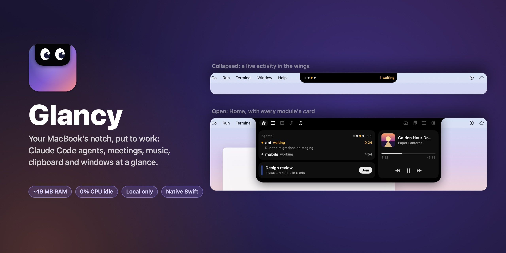
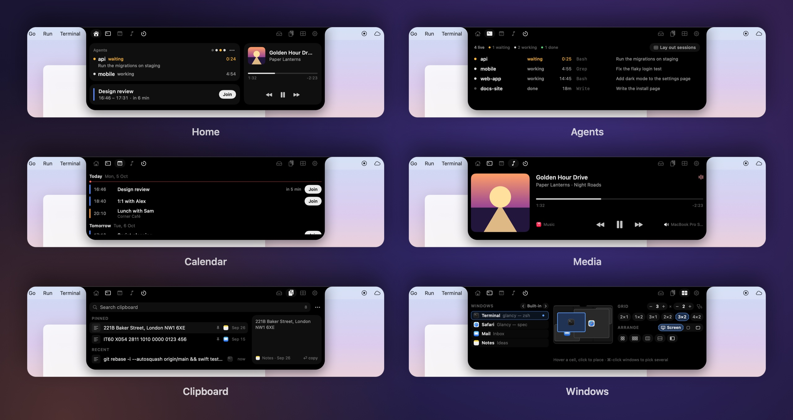

<p align="center">
  
</p>

<p align="center">
  <a href="https://github.com/giacolaiacomo/glancy/actions/workflows/build.yml"></a>
  
  
  
  
  
</p>

<p align="center"><sub><a href="README.md">English</a> · <a href="README.zh-CN.md">简体中文</a> · <b>日本語</b></sub></p>

# Glancy

**MacBook のノッチを、ちゃんと使える場所に。** Glancy はノッチを小さなライブ表示エリアに変えます。作業中の Claude Code セッションや許可待ちのセッション、次の会議と「参加」ボタン、再生中の曲、タイマー、ファイルの一時置き場、クリップボード履歴、そしてウインドウのタイル配置。ホバーでのぞき見、クリックで開きます。

**軽さを最優先に設計。** アイドル時のメモリは約 19 MB、CPU 時間は 1 分あたり 0 秒。ノッチが閉じている間はタイマーもポーリングも動かず、すべてシステムイベントで動きます。データが Mac の外に出ることはありません。

<p align="center">
  
</p>

<sub>画像はすべて架空のデモデータです。</sub>

## 機能

**ノッチ**
- **閉じているとき**：ハードウェアのノッチそのままです。何かが起きると左右に「ウイング」が伸び、いちばん大事なライブ情報を表示します。あなたの許可を待つセッション、まもなく始まる会議、タイマー、音量表示、再生中の曲など。
- **のぞき見**：ホバーするとヒントを表示。セッションの完了、AirPods の接続、曲の切り替えなどのときは短いドロップダウンで知らせます。
- **開いたとき**：クリックするとタブ付きのパネルが開きます。Esc、外側のクリック、カーソルを離すと閉じます。
- ウイングがメニューやステータス項目に重なることはありません。ノッチのないディスプレイでは小さなピル表示も選べます。
- スクリーンショットや画面共有には映りません（設定で変更可、デフォルトはオン）。英語とイタリア語に対応。

**Claude Code のセッション**
- 稼働中のセッションをウイングにドットで表示：作業中、**許可待ち**（琥珀色）、完了、失敗。
- Agents タブ：各セッションのプロジェクト、状態、経過時間、最後に使ったツール、最後のプロンプト。
- セッションをクリックするとそのターミナルを前面に（Terminal、iTerm、Ghostty、Warp、VS Code）。⌥クリックで前面に出してタイル配置。
- **Lay out sessions** で Claude のターミナルをまとめてタイル配置。適用前にプレビューされ、元に戻せます。
- 小さな hook のログを読み取ります（[Claude Code の設定](#claude-code-の設定)を参照）。Glancy 自身が Claude と通信することはありません。

**カレンダー**
- 次の会議をカウントダウン付きで表示し、Zoom、Google Meet、Teams、Webex、Whereby、FaceTime のリンクには **Join** ボタン。
- カレンダータブで今日と明日の予定をカレンダーの色で表示。辞退した予定は非表示、対象のカレンダーも選べます。

**メディア**
- ブラウザを含む**あらゆる**プレーヤーの再生中の曲：アートワーク、再生位置、再生／一時停止、前へ／次へ、出力デバイス。
- ウイングはアートワークの色に。曲が変わると短く表示します。

**HUD、バッテリー、AirPods**
- 音量、明るさ、キーボードバックライトのオーバーレイを、ノッチの控えめな表示に置き換えます（⌥⇧ で 1/4 ステップ）。
- 電源の接続・取り外し、バッテリー残量低下、低電力モードを短く表示。
- AirPods などのヘッドホンが接続されると、左右とケースのバッテリー残量を表示。

**タイマーとポモドーロ**
- 5、15、25、50 分またはカスタム、25/5 のポモドーロサイクル。ウイングにリング表示、終了時に通知。再起動しても続きます。

**シェルフ**
- ファイルをノッチにドラッグして一時的に置いておき、あとで好きな場所へドラッグ。シェルフから AirDrop、共有、クイックルック。最大 24 項目、再起動後も保持。

**クリップボード履歴**
- 直近 60 件のコピー：テキスト、リッチテキスト、リンク、画像、ファイル。検索とピン留めに対応。⌥⌘V で開きます。
- パスワードや、アプリが非表示・一時的と指定した内容、パスワードマネージャーからのコピーは記録しません。一時停止、アプリごとの除外、消去も可能。

**ウインドウ**
- ノッチにディスプレイのライブマップ：セルにホバーすると実際の画面でプレビュー、クリックで配置。
- グリッド（2×1 から自由なサイズまで）を選び、画面全体、ひとつのアプリ、または選んだウインドウ（⌘クリックで順番に）を整列。方式：Balanced、1 セル 1 枚、列、行、メイン＋スタック。
- ウインドウをノッチにドラッグしてセルにドロップ。キーボード：⌃⌥Space でマップを開く、⌃⌥←/→/↑/↓ で左右半分・最大化・元に戻す、⌃⌥F でフィット、⌃⌥B/C/R/M/G で整列（⇧ を加えると最前面のアプリだけ）、⌃⌥Z で取り消し。ショートカットはすべて変更できます。
- どの整列も適用前にプレビューされ、取り消せます。

**通知**（オプトイン、実験的）
- 最近の通知をアプリごとにタブで表示し、届いたときは短く表示。アプリごとにミュート可能。デフォルトはオフで、（読み取り専用で）読むにはフルディスクアクセスが必要です。

## インストール

macOS 14 以降が必要です。Apple シリコンと Intel の両方で動作し、ノッチ付きの MacBook 向けに作られています。[制限事項](#制限事項)も参照してください。

**ダウンロード**

1. [最新リリース](https://github.com/giacolaiacomo/glancy/releases/latest)から `Glancy-x.y.z.zip` をダウンロードして展開し、**Glancy** をアプリケーションフォルダにドラッグします。
2. 開きます。Glancy は有料の Apple Developer ID で署名されていないため、初回は macOS が検証できないと表示します。**完了**をクリックし、**システム設定 → プライバシーとセキュリティ**を開いて**このまま開く**をクリックしてください。ターミナルなら `xattr -dr com.apple.quarantine /Applications/Glancy.app` でも構いません。
3. 初回起動時、ノッチに短い権限チェックリストが表示されます。どの権限も任意です。

リリースの zip はタグ付きのソースから [GitHub Actions](.github/workflows/release.yml) でビルドされているので、何が入っているかを正確に確認できます。ad-hoc 署名のため注意点がひとつあります。macOS は新しいバージョンを別のアプリとして扱うので、アップデート後にアクセシビリティなどの許可をやり直す必要がある場合があります。Apple Development 証明書で自分でビルドすればこれを避けられます（下記参照）。

**Homebrew**（ソースからビルド）

```sh
brew install giacolaiacomo/tap/glancy
brew services start glancy     # 今すぐ起動し、ログインのたびに起動
```

アップデート：`brew upgrade glancy`。削除：`brew services stop glancy && brew uninstall glancy`。

**ソースから**

```sh
git clone https://github.com/giacolaiacomo/glancy.git
cd glancy
./install.sh
```

`~/Applications/Glancy.app` をビルドし、**ログイン時に開く**をオンにして起動します。アップデート：`git pull && ./install.sh`。データ、設定、権限ごと削除：`./uninstall.sh`。

ビルドには Swift 6.2 ツールチェーン（Xcode 26 またはそのコマンドラインツール：`xcode-select --install`）と `cmake`（`brew install cmake`）が必要です。キーチェーンに "Apple Development" 証明書があれば `scripts/build-app.sh` は最初のものを使って署名するので、再ビルドしても許可が保たれます。なければ ad-hoc 署名になります。`GLANCY_SIGN_IDENTITY` で指定することもできます。

## Claude Code の設定

Agents モジュールは、小さな Claude Code の hook が書き出すログを読みます。Glancy が Claude の設定を変更することはないので、この手順はご自身で行ってください。

1. hook をコピー（このリポジトリのクローン内で）：`mkdir -p ~/.claude/hooks && cp hooks/cc-dashboard-event.sh ~/.claude/hooks/ && chmod +x ~/.claude/hooks/cc-dashboard-event.sh`
2. `~/.claude/settings.json` に次の 7 つのイベントで追加します（既存の `hooks` とマージし、`YOU` は自分のユーザー名に置き換えてください）。

```json
{
  "hooks": {
    "SessionStart":      [{ "hooks": [{ "type": "command", "command": "/Users/YOU/.claude/hooks/cc-dashboard-event.sh", "timeout": 5 }] }],
    "SessionEnd":        [{ "hooks": [{ "type": "command", "command": "/Users/YOU/.claude/hooks/cc-dashboard-event.sh", "timeout": 5 }] }],
    "UserPromptSubmit":  [{ "hooks": [{ "type": "command", "command": "/Users/YOU/.claude/hooks/cc-dashboard-event.sh", "timeout": 5 }] }],
    "PostToolUse":       [{ "hooks": [{ "type": "command", "command": "/Users/YOU/.claude/hooks/cc-dashboard-event.sh", "timeout": 5 }] }],
    "PermissionRequest": [{ "hooks": [{ "type": "command", "command": "/Users/YOU/.claude/hooks/cc-dashboard-event.sh", "timeout": 5 }] }],
    "Stop":              [{ "hooks": [{ "type": "command", "command": "/Users/YOU/.claude/hooks/cc-dashboard-event.sh", "timeout": 5 }] }],
    "StopFailure":       [{ "hooks": [{ "type": "command", "command": "/Users/YOU/.claude/hooks/cc-dashboard-event.sh", "timeout": 5 }] }]
  }
}
```

hook はイベントごとに `~/.claude/hooks/data/cc-dashboard/events.jsonl` へ 1 行追記します：時刻、イベント名、セッション ID、作業フォルダ、ツール名、プロンプトの先頭 200 文字。何も出力せず、常に終了コード 0 で終わるので、Claude Code を止めることはありません。`jq` が必要で、macOS 15 以降には標準で入っています（macOS 14 では `brew install jq`）。新しいセッションは開始と同時にノッチに表示されます。

## 権限

すべての権限は任意です。ない場合、そのモジュールの機能が少し減るだけです。設定 → 権限 で状態を確認し、ボタンから許可できます。

| 権限 | できること | ない場合 |
|---|---|---|
| **カレンダー** | 次の会議、Join ボタン、カレンダータブ | カレンダーなし |
| **アクセシビリティ** | HUD のキー処理、ウインドウのタイル配置、セッションのターミナルへの移動、クリップボードでの ⌘C の検知と選択後の貼り付け、メニュー幅の計測（左のウイングがメニューに重ならないように） | システムの HUD のまま、タイル配置なし、クリップボードはアプリ切り替え時やノッチを開いたときに記録、左のウイングは非表示 |
| **Bluetooth** | AirPods やヘッドホンの接続とバッテリー | ヘッドホンの表示なし |
| **通知** | タイマー終了時の通知 | タイマーはノッチ内で静かに終了 |
| **オートメーション**（ミュージック、Spotify） | この 2 つのアプリ用の予備の読み取り。メインの読み取りがその macOS で動かない場合だけ使用 | メインの読み取りでメディアは動作 |
| **フルディスクアクセス** | macOS の通知データベースの読み取り。通知モジュールをオンにした場合のみ | 通知モジュールはオフのまま |

## プライバシー

Glancy は**ネットワーク通信を一切行いません**。テレメトリ、アカウント、アップデート確認もありません。読み取るのはすべてローカルのデータです。

- **Claude Code**：上記の hook ログを末尾から読み取り専用で。Glancy が書き込んだり、Claude を実行したりすることはありません。
- **カレンダー**：EventKit 経由の予定。メモリ上のみ。
- **メディア**：[mediaremote-adapter](https://github.com/ungive/mediaremote-adapter)（アプリに同梱され、システムの Perl で動く小さなヘルパー）が出力する、システムの再生中情報。予備としてミュージックと Spotify には AppleScript。
- **クリップボード**：コピーした内容を `~/Library/Application Support/Glancy/clipboard/`（本人のみアクセス可）に保存。非表示指定の内容とパスワードマネージャーは除外。いつでも消去できます。
- **通知**：モジュールをオンにした場合のみ、macOS の通知データベースを読み取り専用で開きます。
- **ウインドウ**：マップを描くため、アクセシビリティ経由でウインドウのタイトルと位置を取得。保存するのはグリッド、レイアウト、ショートカットだけです。

設定は `~/Library/Preferences/ai.glancy.app.plist`、データ（クリップボード、シェルフ、タイマー、ウインドウのレイアウト）は `~/Library/Application Support/Glancy/` にあります。`./uninstall.sh` ですべて削除されます。詳しくは [SECURITY.md](SECURITY.md) を参照してください。

## 動作環境

- macOS 14 Sonoma 以降。開発環境は macOS 26、14 インチ MacBook Pro と外部のウルトラワイドディスプレイ。
- フル機能にはノッチ付きの MacBook が必要です。他のディスプレイでは任意のピル表示が使えます。
- Agents には Claude Code と上記の hook が必要です。

## 制限事項

- **ノッチのためのアプリです。** ノッチのない Mac やディスプレイでは、画面上部中央に小さなピルを表示します（デフォルトはオフ）。動作はしますが、本来の使い方ではありません。
- **一部の機能にはアクセシビリティが必要です。**[権限](#権限)を参照してください。
- **ウインドウのタイル配置はアプリ次第です。** 最小サイズより小さくできないアプリや、自分でウインドウを動かすアプリがあります。Glancy はそうしたウインドウをセルの端にそろえ、ぴったり収まらなかったものを知らせます。タイル配置は Glancy でいちばん新しい機能で、他の部分ほど実際の使用で鍛えられていません。
- **ad-hoc 署名のビルド**（リリースの zip、または証明書なしでのビルド）は、アップデートのたびに権限が外れます。macOS が新しいアプリとして扱うためです。システム設定で再度許可してください。
- **通知は実験的な機能です。** macOS の通知データベースは非公開で仕様もありません。読み取り側でスキーマを確認し、知らない形式なら自動でオフになります。検証はテスト用データでのみ行っており、macOS の各バージョンでは確認していません。
- **メディア**は mediaremote-adapter を通じて macOS の非公開フレームワークに依存しています。将来の macOS で動かなくなった場合は、ミュージックと Spotify だけに切り替わります。
- 再生中情報のヘルパーは別プロセスで約 5 MB あり、Glancy 本体の約 19 MB とは別です。

## 開発

```sh
swift build && swift test                      # 警告 0 が前提
scripts/lint.sh                                # 閉じている間のタイマー、ポーリング、マウス移動の監視を禁止
.build/debug/Glancy --self-test                # 全モジュールのヘッドレスチェック（CI でも実行）
scripts/render.sh                              # すべての表示状態を render-out/ に PNG で出力（実データを使用、--it でイタリア語）
scripts/screenshots.sh                         # README の画像を再生成（架空のデモデータ）
scripts/build-app.sh build/Glancy.app          # アプリをビルド（UNIVERSAL=1 で Apple シリコンと Intel の両対応）
scripts/footprint.sh                           # アイドル時のメモリと CPU
Glancy --diagnose                              # 起動中のアプリの状態（モジュール、ディスプレイ、リソース）
```

各モジュールは `Sources/GlancyKit/<Module>/` にあり、`GlancyModule`（開始、停止、表示状態、タブ、ホームカード）を実装し、`Modules.swift` で登録します。Glancy を軽く保つルールは、ノッチが閉じている間はタイマー、アニメーション、ポーリングを一切動かさず、システムイベントの監視だけにすること。`scripts/lint.sh` がこれをチェックします。詳しくは [docs/ARCHITECTURE.md](docs/ARCHITECTURE.md) を参照。リリース：GitHub でリリースを公開すると [release.yml](.github/workflows/release.yml) がユニバーサル版をビルドし、zip を添付します。

## クレジット

- [mediaremote-adapter](https://github.com/ungive/mediaremote-adapter)、Jonas van den Berg とコントリビューター（BSD 3-Clause）。`Vendor/` に同梱し、再生中情報の読み取りに使用。
- [MacroVisionKit](https://github.com/TheBoredTeam/MacroVisionKit)（MIT）：フルスクリーンのスペースを検出する手法。
- [Tessera](https://github.com/giacolaiacomo/tessera)（MIT）：タイル配置エンジンの出発点となったグリッド、整列、ショートカットのロジック。ウインドウ配置の細部は Rectangle（MIT）を参考にしています。

詳細な表記は [NOTICE](NOTICE) と [Sources/GlancyKit/Tiling/NOTICE.md](Sources/GlancyKit/Tiling/NOTICE.md) にあります。GPL のコードは含まれていません。他のノッチアプリは参考として読んだだけです。

## 免責事項

Glancy は独立したプロジェクトで、Apple や Anthropic とは関係がなく、承認も受けていません。Claude および Claude Code は Anthropic, PBC の商標です。

## ライセンス

[MIT](LICENSE)
