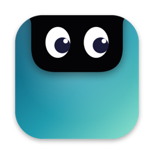

<div align="center">



# Glancy

**Your MacBook's notch, put to work.**<br>
Coding agents, your next meeting, music, notes, clipboard and windows, one glance away.

<a href="https://github.com/giacolaiacomo/glancy/releases/latest/download/Glancy.dmg"></a>

<sub>macOS 14+ · Apple Silicon &amp; Intel · signed &amp; notarized · updates itself</sub><br>
<sub>or with Homebrew: <code>brew install --cask giacolaiacomo/tap/glancy</code> (<a href="#homebrew">details</a>)</sub>

<br>

<a href="https://github.com/giacolaiacomo/glancy/releases/latest"></a>
<a href="https://github.com/giacolaiacomo/glancy/releases"></a>
<a href="https://github.com/giacolaiacomo/glancy/actions/workflows/build.yml"></a>


<a href="LICENSE"></a>

<sub><b>English</b> · <a href="README.zh-CN.md">简体中文</a> · <a href="README.ja.md">日本語</a></sub>

</div>

<br>

<p align="center">
  
</p>
<p align="center"><sub>Images use made-up demo data.</sub></p>

Glancy turns the notch into a small live surface. Closed, it's exactly the hardware notch; when something happens, "wings" grow either side of it. Hover to peek, click to open the full panel.

**Light by design:** about 18 MB of RAM and 0 CPU-seconds a minute at idle. A closed notch runs no timers or polling: everything is driven by system events. Nothing leaves your Mac.

## Highlights

| Module | What it does |
|---|---|
| **Agents** | Claude Code, Codex and OpenCode sessions on one board: working, **waiting for you**, done. Click to jump to the terminal or editor. |
| **Calendar** | Your next meeting with a countdown and a **Join** button (Zoom, Meet, Teams, Webex, Whereby, FaceTime). |
| **Media** | What's playing in any player, browsers included, with controls and the output device. |
| **Notes** | Plain-text `.md` notes with tick boxes, and **voice notes** transcribed on this Mac. |
| **Command bar** | ⌃⌥K: apps, calculator, units and currencies, and every module's commands. |
| **Clipboard** | The last 60 copies with search and pins (⌥⌘V); passwords are skipped. |
| **Windows** | A live grid map in the notch, auto-arrange, workspaces; every move previewed and undoable. |
| **And more** | Control toggles, system Monitor, timer and Pomodoro, file shelf, a quiet volume/brightness HUD, battery and AirPods. |

**Fits your screen:** Settings → General → **Size** (Normal, Large, Extra large) scales the whole panel for big or high-resolution displays. **Stays current:** Glancy updates itself in the app.

## Features

Click a module to expand it.

<details>
<summary><b>The notch</b>: closed, peek, open</summary>

- **Closed:** exactly the hardware notch. When something is happening, wings grow either side with the most important live activity: an agent waiting for you, a meeting about to start, a timer, the volume HUD, what's playing.
- **Peek:** hover for a hint, or a short drop-down when something happens (a session finished, AirPods connected, a new track).
- **Open:** click for the full panel with tabs. Esc, a click outside or moving away closes it.
- Wings never sit on top of your menus or status items. Without a notch (a Mac without one, or a MacBook closed on an external display) a small pill at the top centre; on extra displays it's optional.
- **Size:** Normal, Large or Extra large in Settings → General; Glancy tells you when a size doesn't fit the screen.
- Hidden from screenshots and screen sharing (a setting, on by default). English and Italian.

</details>

<details>
<summary><b>Agents</b>: Claude Code, Codex and OpenCode</summary>

- Claude Code (Terminal, VS Code, Cursor, the Claude app), Codex (CLI, VS Code, the Codex app) and OpenCode on one board.
- Every live session as a dot in the wings: working, **waiting for permission** (amber), done, failed.
- The Agents tab: project, state, time in that state, last tool and the last prompt, for every session.
- Click a session to bring it forward: its terminal (Terminal, iTerm, Ghostty, Warp), its editor window (VS Code, Cursor) or the Codex app. ⌥-click to bring it forward and tile it.
- **Lay out sessions** tiles all your Claude terminals at once, previewed first and undoable.
- Claude Code needs a small hook ([setup](#claude-code)); Codex and OpenCode need none ([setup](#codex-and-opencode)). Glancy only reads: it never talks to an agent.

</details>

<details>
<summary><b>Calendar</b>: next meeting and Join</summary>

- Your next meeting, with a countdown and a **Join** button for Zoom, Google Meet, Teams, Webex, Whereby and FaceTime links.
- Today and tomorrow in the Calendar tab, in your calendars' colours. Declined events hidden; pick which calendars count.

</details>

<details>
<summary><b>Media, HUD, battery and AirPods</b></summary>

- What's playing in **any** player, browsers included: artwork, progress, play/pause, previous/next, the output device. Artwork tint in the wings, a peek on track change.
- Replaces the volume, brightness and keyboard-backlight overlays with a quiet one in the notch (⌥⇧ for quarter steps).
- Charging, unplugging, low battery and Low Power Mode as a brief activity.
- AirPods and other headphones as they connect, with left, right and case battery.

</details>

<details>
<summary><b>Timer, Pomodoro and Shelf</b></summary>

- 5, 15, 25, 50 minutes or custom, and a 25/5 Pomodoro cycle. A ring in the wings, an alert at the end; survives a relaunch.
- Drag files onto the notch to park them, drag them out anywhere later. AirDrop, Share and Quick Look from the shelf. Up to 24 items, kept across relaunches.

</details>

<details>
<summary><b>Notes and voice notes</b></summary>

- Plain-text `.md` notes in a folder you can open in Finder, saved as you type; `- [ ] ` makes a tick box and a note can be pinned to Home. ⌃⌥N opens a note.
- **Voice notes:** ⌃⌥V starts and stops a recording from any app (stops by itself after 5, 15, 30 or 60 minutes; 30 by default). Saved as `.m4a` next to the notes, with playback and drag-out.
- **Transcription** is on by default and entirely on this Mac (on-device Speech Recognition); nothing is sent anywhere.

</details>

<details>
<summary><b>Command bar</b></summary>

- ⌃⌥K opens a search field over everything: apps, a calculator, unit and currency conversions (rates from the ECB, fetched only when you type a currency query), a web-search fallback, and every module's commands (join the next meeting, keep awake for an hour, save a workspace, top CPU…). ⏎ runs, ⌘⏎ does the secondary action.
- Learns what you use. Each source can be switched off in Settings → Command bar.

</details>

<details>
<summary><b>Clipboard history</b></summary>

- The last 60 copies: text, rich text, links, images and files, with search and pins. ⌥⌘V opens it.
- Skips passwords and anything apps mark as concealed or transient, plus password managers. Pause, per-app exclusions and Clear.

</details>

<details>
<summary><b>Windows</b>: grid map, auto-arrange, workspaces</summary>

- A live map of the display in the notch: hover cells to preview on the real screen, click to place.
- Pick a grid (2×1 up to anything), arrange the whole screen, one app, or exactly the windows you pick (⌘-click, in order). Strategies: Balanced, one per cell, columns, rows, master + stack.
- Drag a window into the notch to drop it on a cell. Keyboard: ⌃⌥Space opens the map, ⌃⌥←/→/↑/↓ halves, maximise and restore, ⌃⌥F fit, ⌃⌥B/C/R/M/G arrange (add ⇧ for the front app only), ⌃⌥Z undo. Every shortcut is configurable.
- **Auto-arrange** (⌃⌥A): picks a layout for the windows on the display under the pointer and applies it at once (⇧ for the front app only); undo with ⌃⌥Z.
- **Workspaces:** save where every window sits on every display and bring it back in one click, with an optional shortcut each. Missing apps open on restore, and one can apply itself when that display setup connects.
- Every arrangement is previewed before it's applied and can be undone.

</details>

<details>
<summary><b>Control and Monitor</b></summary>

- **Control:** toggles (Keep awake, Dark mode, Wi-Fi, desktop icons, hidden files) and one-shot tools (lock, display off, screen saver, screenshot, colour picker, camera mirror, empty Trash, eject all). Keep awake takes a duration and shows its end time; emptying the Trash asks first.
- **Monitor:** CPU, memory, GPU, disk, network and energy as indicators on the left; on the right, the top apps for the selected one (or each process). Quit or force quit from the list (force quit asks first). Sampled only while the tab is open (every 1 or 2 s, your choice).

</details>

<details>
<summary><b>Notifications</b> (opt-in, experimental)</summary>

- The last notifications in a tab, grouped by app, with a peek as they arrive and a per-app mute list. Off by default; needs Full Disk Access to read them (read-only).

</details>

## Install

Glancy needs **macOS 14 Sonoma or later**, runs on Apple Silicon and Intel, and is made for MacBooks with a notch (it works without one; see [Limitations](#limitations)).

### Download

1. **[Download Glancy.dmg](https://github.com/giacolaiacomo/glancy/releases/latest/download/Glancy.dmg)** (always the latest release), open it and drag **Glancy** to Applications.
2. Open it. It is signed with a Developer ID and notarized by Apple, so it opens normally and keeps its permissions across updates.
3. The first launch opens a short **permission checklist** in the notch. Every permission is optional: allow only what you need ([what each one does](#permissions)).

Turn on **Launch at login** in Settings → General to start it with your Mac.

### Homebrew

```sh
brew trust giacolaiacomo/tap        # once: recent Homebrew asks before loading casks from a third-party tap
brew install --cask giacolaiacomo/tap/glancy
```

This installs the same notarized app. To remove it: `brew uninstall --cask glancy` (add `--zap` to also remove its data and settings). If you installed the old formula, which built from source, run `brew uninstall glancy` first.

### From source

```sh
git clone https://github.com/giacolaiacomo/glancy.git
cd glancy
./install.sh
```

This builds `~/Applications/Glancy.app`, turns on **Launch at login** and starts it. To update: `git pull && ./install.sh`. To remove it, with its data, settings and permissions: `./uninstall.sh`.

Building needs the Swift 6.2 toolchain (Xcode 26 or its Command Line Tools: `xcode-select --install`) and `cmake` (`brew install cmake`). `scripts/build-app.sh` signs with the first "Apple Development" certificate in your keychain if you have one, which keeps your permissions across rebuilds; otherwise it signs ad-hoc. Set `GLANCY_SIGN_IDENTITY` to choose.

### Updates

Glancy updates itself with [Sparkle](https://sparkle-project.org). When there is a new version, a green arrow appears in the panel's top row, next to the gear: click it to see what's new and install (Glancy relaunches by itself). **Check now** and **Check for updates automatically** are in Settings → General, and the command bar has **Check for Updates**. Updates are signed (EdDSA, checked by Sparkle) and notarized. Homebrew knows the app updates itself, so `brew upgrade` leaves it alone; `brew upgrade --cask glancy` also works.

## Agents setup

### Claude Code

The Agents module reads a log written by a tiny Claude Code hook. Glancy never edits your Claude settings, so this step is yours:

1. Copy the hook (from a clone of this repo): `mkdir -p ~/.claude/hooks && cp hooks/cc-dashboard-event.sh ~/.claude/hooks/ && chmod +x ~/.claude/hooks/cc-dashboard-event.sh`
2. Add it to `~/.claude/settings.json` for these seven events (merge with any `hooks` you already have; replace `YOU` with your user name):

<details>
<summary><code>settings.json</code></summary>

```json
{
  "hooks": {
    "SessionStart":      [{ "hooks": [{ "type": "command", "command": "/Users/YOU/.claude/hooks/cc-dashboard-event.sh", "timeout": 5 }] }],
    "SessionEnd":        [{ "hooks": [{ "type": "command", "command": "/Users/YOU/.claude/hooks/cc-dashboard-event.sh", "timeout": 5 }] }],
    "UserPromptSubmit":  [{ "hooks": [{ "type": "command", "command": "/Users/YOU/.claude/hooks/cc-dashboard-event.sh", "timeout": 5 }] }],
    "PostToolUse":       [{ "hooks": [{ "type": "command", "command": "/Users/YOU/.claude/hooks/cc-dashboard-event.sh", "timeout": 5 }] }],
    "PermissionRequest": [{ "hooks": [{ "type": "command", "command": "/Users/YOU/.claude/hooks/cc-dashboard-event.sh", "timeout": 5 }] }],
    "Stop":              [{ "hooks": [{ "type": "command", "command": "/Users/YOU/.claude/hooks/cc-dashboard-event.sh", "timeout": 5 }] }],
    "StopFailure":       [{ "hooks": [{ "type": "command", "command": "/Users/YOU/.claude/hooks/cc-dashboard-event.sh", "timeout": 5 }] }]
  }
}
```

</details>

The hook appends one line per event to `~/.claude/hooks/data/cc-dashboard/events.jsonl`: time, event, session id, working folder, tool name, the first 200 characters of your prompt, and which app the session runs in (the app's bundle id, `TERM_PROGRAM` and Claude Code's entry point, so a session in VS Code opens VS Code and one in Terminal opens Terminal). It prints nothing, always exits 0 and can't block Claude Code. It needs `jq`, which macOS 15 and later include (`brew install jq` on macOS 14). The same hook fires in the terminal, in the VS Code and Cursor extensions and in the Claude app. An older copy of the hook still works: the app is then found from the process tree when you open the notch.

### Codex and OpenCode

Nothing to set up; each source can be turned off in Settings → Agents.

- **Codex** (CLI, Codex app, VS Code extension): Glancy follows the session files Codex already writes in `~/.codex/sessions/`, read-only. It sees when a turn runs, finishes, fails, or waits for your answer or approval. A click opens the session in the Codex app, in VS Code, or brings its terminal forward. Your `config.toml` (and its `notify` command) is never touched.
- **OpenCode:** Glancy reads OpenCode's own database (`~/.local/share/opencode/opencode.db`, read-only) for working / done / failed. To also see when it waits for a permission, click **Install** in Settings → Agents → OpenCode: it copies [`hooks/glancy-opencode.js`](hooks/glancy-opencode.js) to `~/.config/opencode/plugins/glancy.js` (your `opencode.json` is not edited; a different file already there is kept as a backup). **Uninstall** removes it.

## Permissions

Every permission is optional: without one, its module just does less. Settings → Permissions shows each one's state with a button to grant it.

| Permission | What it enables | Without it |
|---|---|---|
| **Calendar** | Next meeting, Join button, Calendar tab | No calendar |
| **Accessibility** | HUD key interception; window tiling; jumping to a session's terminal; ⌘C capture for the clipboard and paste-after-choosing; measuring the menus so the left wing never covers them | System HUD stays; no tiling; clipboard catches copies when you switch apps or open the notch; the left wing stays hidden |
| **Bluetooth** | AirPods and headphones connecting, with battery | No headphone peeks |
| **Notifications** | The alert when a timer ends | Timer ends silently in the notch |
| **Automation** (Music, Spotify) | A fallback reader for those two apps, used only if the main now-playing reader doesn't work on your macOS | Media still works through the main reader |
| **Microphone** | Voice notes and the mic mute shortcut | No voice notes, no mic mute |
| **Speech Recognition** | Voice notes written out, on this Mac | Recordings stay audio only |
| **Camera** | The Control tab's camera mirror | No mirror |
| **Full Disk Access** | Reading macOS's notification database, only if you turn on the Notifications module | Notifications module stays off |

## FAQ

<details>
<summary><b>Accessibility is on in System Settings, but Glancy says it's missing</b></summary>

The switch belongs to an older entry (an earlier version or build with a different signature) that macOS no longer matches to this app. Press **Allow…** next to Accessibility in Glancy's Settings → Permissions: Glancy clears its own stale entry and asks again, so turning the switch on works. Or do it by hand: in System Settings → Privacy & Security → Accessibility, select Glancy, remove it with **−**, then add it again with **+**.

</details>

<details>
<summary><b>I don't see Glancy</b></summary>

It lives in the notch and has no Dock icon. Move the pointer onto the notch to peek and click to open. On a Mac without a notch, or a MacBook closed on an external display, it shows a small pill at the top centre of the main display instead; **Pill on external displays** in Settings → General adds it to the other displays.

</details>

<details>
<summary><b>The text is too small on my big display</b></summary>

Settings → General → **Size**: Normal, Large or Extra large. The whole panel scales; if a size doesn't fit the screen, Glancy says so under the setting.

</details>

<details>
<summary><b>How do I update?</b></summary>

Nothing to do: when a new version is out, a green arrow appears next to the gear in the panel; click it to install. To check right away: Settings → General → **Check now**, or **Check for Updates** in the command bar. With Homebrew, `brew upgrade --cask glancy` works too. See [Updates](#updates).

</details>

## Privacy

Glancy has no telemetry and no account. Its only regular network request is the **update check**: it downloads `appcast.xml` from this repository's latest GitHub release (at launch, then at most once a day when you open the panel; turn it off in Settings → General). Exchange rates are fetched from the ECB only when you type a currency in the command bar. Everything else is read locally:

- **Claude Code:** the hook log above, read-only, from the end. Glancy never writes to it and never runs Claude.
- **Codex:** the session files in `~/.codex/sessions/`, read-only (only the session's folder, state, first prompt, last tool and last reply are kept, in memory).
- **OpenCode:** its database, opened read-only; and, if you install the plugin, the event log it writes to `~/Library/Application Support/Glancy/agents/`.
- **Calendar:** your events through EventKit, in memory.
- **Media:** the system's now-playing information through [mediaremote-adapter](https://github.com/ungive/mediaremote-adapter), a small helper (bundled, run with the system Perl) that prints what's playing; or AppleScript for Music and Spotify as a fallback.
- **Clipboard:** what you copy, kept in `~/Library/Application Support/Glancy/clipboard/` (owner-only permissions), skipping concealed items and password managers. Clear it any time.
- **Notes and voice notes:** `.md` and `.m4a` files in `~/Library/Application Support/Glancy/notes/`; transcription runs on this Mac.
- **Notifications:** only if you turn the module on, macOS's notification database, opened read-only.
- **Windows:** window titles and frames through Accessibility, to draw the map. Nothing is stored except your grids, layouts and shortcuts.

Settings live in `~/Library/Preferences/ai.glancy.app.plist`; data (clipboard, shelf, notes, timer, window layouts) in `~/Library/Application Support/Glancy/`. `./uninstall.sh` removes all of it. See [SECURITY.md](SECURITY.md).

## Limitations

- **Made for the notch.** Without one, the pill at the top centre works, but it's not the point.
- **Some features need Accessibility,** see [Permissions](#permissions).
- **Window tiling depends on each app.** Some apps refuse sizes below their minimum or animate their own frames; Glancy re-anchors such windows to the cell's edges and tells you which ones didn't fit exactly. Tiling is the newest part of Glancy and has seen less real-world use than the rest.
- **Builds you make yourself** without a certificate are ad-hoc signed and lose their permissions on every rebuild: macOS sees a new app. Allow them again in System Settings.
- **Notifications are experimental.** macOS's notification database is private and undocumented; the reader checks the schema and turns itself off if it doesn't recognise it. It has only been checked against fixtures, not across macOS versions.
- **Media** relies on a private macOS framework through mediaremote-adapter. If a future macOS breaks it, Glancy falls back to Music and Spotify only. The now-playing helper is a separate process of about 5 MB, on top of Glancy's ~18 MB.

## Development

```sh
swift build && swift test                      # 0 warnings expected
scripts/lint.sh                                # no timers, polling or mouse-moved monitors while collapsed
.build/debug/Glancy --self-test                # headless checks of every module (also run in CI)
scripts/render.sh                              # every surface state to PNG in render-out/ (your real data; --it for Italian)
scripts/screenshots.sh                         # regenerate the README images (made-up demo data)
scripts/build-app.sh build/Glancy.app          # the app bundle (UNIVERSAL=1 for Apple Silicon + Intel)
scripts/footprint.sh                           # memory and CPU of an idle run
Glancy --diagnose                              # state of the running app (modules, displays, resources)
```

Each module lives in `Sources/GlancyKit/<Module>/` and implements `GlancyModule` (start, stop, visibility, tab, Home card); `Modules.swift` registers them. The rule that keeps Glancy light: a closed notch runs no timers, animations or polling, only system event observers; `scripts/lint.sh` enforces it. See [docs/ARCHITECTURE.md](docs/ARCHITECTURE.md).

Releases: the notarized DMG is made on the maintainer's Mac with `scripts/make-dmg.sh`, which writes `Glancy-x.y.z.dmg`, a same-bytes `Glancy.dmg` for the stable download link, and Sparkle's `appcast.xml`; all three are attached to the release. Publishing a release also runs [release.yml](.github/workflows/release.yml), which builds and checks the universal app from the tag.

## Contributing

Bug reports and ideas are welcome in [Issues](https://github.com/giacolaiacomo/glancy/issues); the output of `Glancy --diagnose` helps. For pull requests, keep the closed-notch rule above and run `swift test` and `scripts/lint.sh`. Security issues: see [SECURITY.md](SECURITY.md).

## Credits

- [mediaremote-adapter](https://github.com/ungive/mediaremote-adapter) by Jonas van den Berg and contributors (BSD 3-Clause), vendored in `Vendor/`: the now-playing reader.
- [Sparkle](https://sparkle-project.org) (MIT): in-app updates.
- [MacroVisionKit](https://github.com/TheBoredTeam/MacroVisionKit) (MIT): the technique for detecting full-screen spaces.
- [Tessera](https://github.com/giacolaiacomo/tessera) (MIT): the grid, arrangement and hotkey logic the tiling engine started from. Rectangle (MIT) informed the window-placement details.

Full notices in [NOTICE](NOTICE) and [Sources/GlancyKit/Tiling/NOTICE.md](Sources/GlancyKit/Tiling/NOTICE.md). No GPL code is included; other notch apps were read as reference only.

## Disclaimer

Glancy is an independent project, not affiliated with or endorsed by Apple or Anthropic. Claude and Claude Code are trademarks of Anthropic, PBC.

## License

[MIT](LICENSE)
